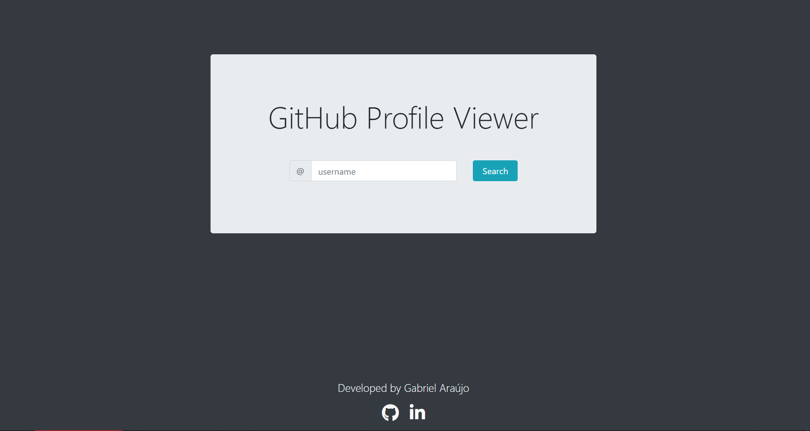

# GitHub Profile-Viewer
> Lists all public repositories of a GitHub user.

## About this Project

The idea for this project came about through a challenge proposed in one of the <a href="https://rocketseat.com.br">Rocketseat</a> classes.

## Why?

This project is part of my personal portfolio and I would be very happy to receive feedback on the project, code, structure, anything that can make me a better developer!

E-mail: <a href="mailto:gabrielcaetanodm@gmail.com">gabrielcaetanodm@gmail.com</a> | 
LinkedIn: <a href="https://www.linkedin.com/in/gabrielcaetanodm/" target="_blank">gabrielcaetanodm</a>

Also, you can use this design as you want, it's free to copy, change and improve.

## Functionality

- Lists all public repositories of a GitHub user.
- Indicates the main language of each listed repository.

## How to use

- Access the project page through the link <a href="https://gabriaraujo.github.io/profile-viewer/" target="_blank">gabriaraujo.github.io/profile-viewer/</a>.
- Enter the <a href= "https://github.com" target="_blank">GitHub</a> username that you want to look up in the search field and press the "Search" button.
- If the username exists, a list will be displayed with all the public user repositories and the main language of each.
- If the username does not exist, an alert will be triggered by the browser.

## Built With

- <a href="https://html.spec.whatwg.org" target="_blank">HTML</a> - Markup language for documents designed to be displayed in a web browser.
- <a href="https://www.javascript.com" target="_blank">JavaScript</a> - Lightweight, interpreted, or just-in-time compiled programming language with first-class functions 
that enables interactive web pages.
- <a href="https://github.com/axios/axios" target="_blank">Axios</a> - Promise based HTTP client for the browser 
and <a href="https://nodejs.org/en/" target="_blank">Node.js</a>.
- <a href="https://getbootstrap.com" target="_blank">Bootstrap</a> - CSS framework directed at responsive, mobile-first front-end web development.
- <a href="https://fontawesome.com" target="_blank">Font Awesome</a> - Font and icon toolkit based on CSS and LESS.

## License

The software is available under the <a href="https://github.com/gabriaraujo/profile-viewer/blob/master/LICENSE">MIT License</a>.
